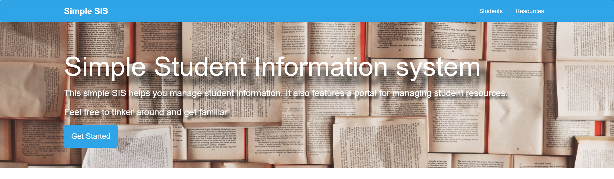
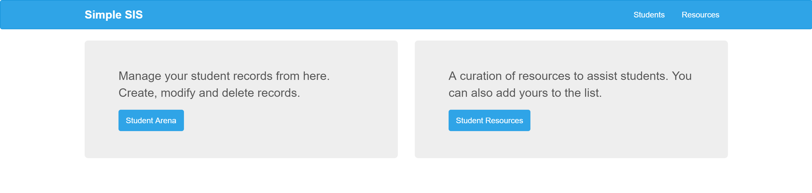
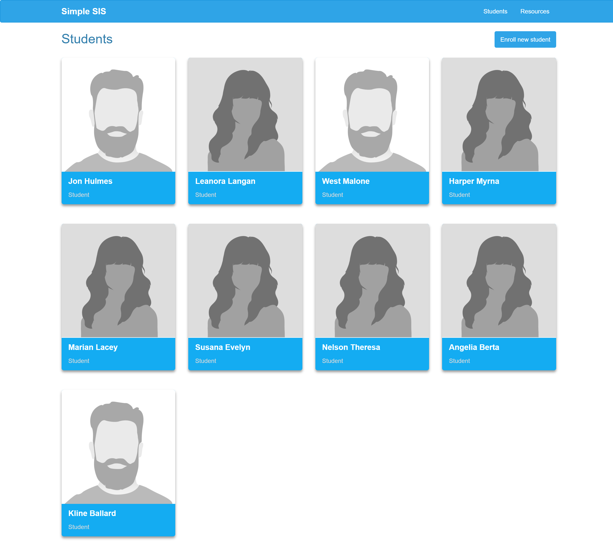
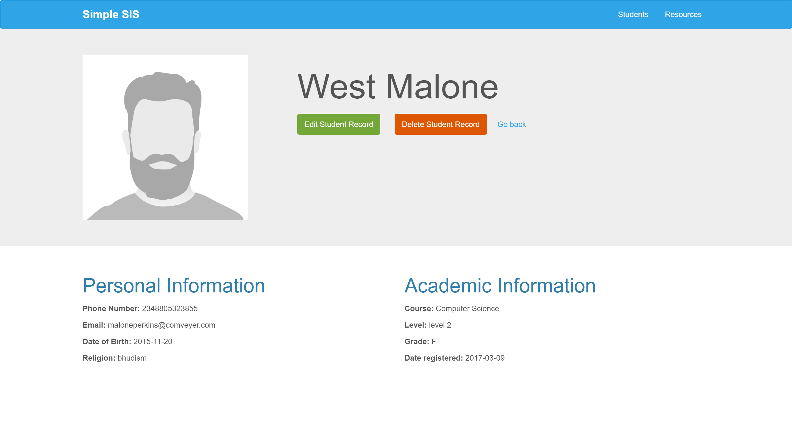
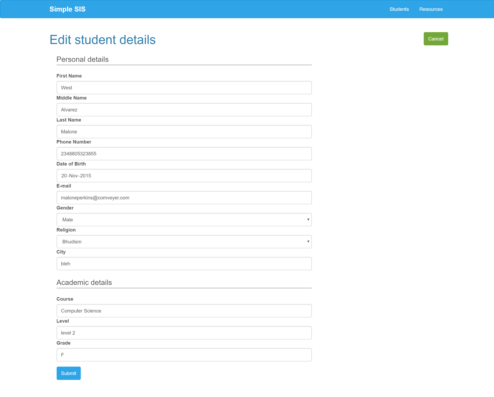
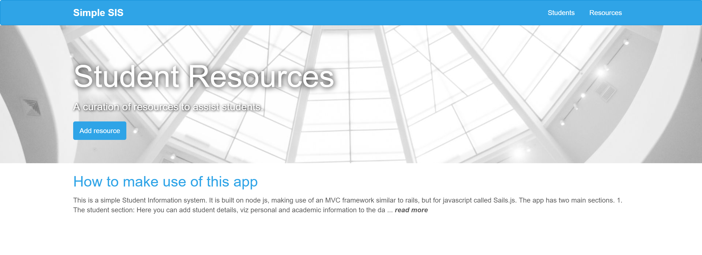

# sis-app

A simple student Information system.

Users can manage student information within the app.

* 
* 

## Features

Users can view all students registered on the system

* 

Users can also view particular details of any one record
* 

Adding and editing of records is also possible

The app also features a blog-like section where resources can be curated
* 
* 

A [Sails](http://sailsjs.org) application
